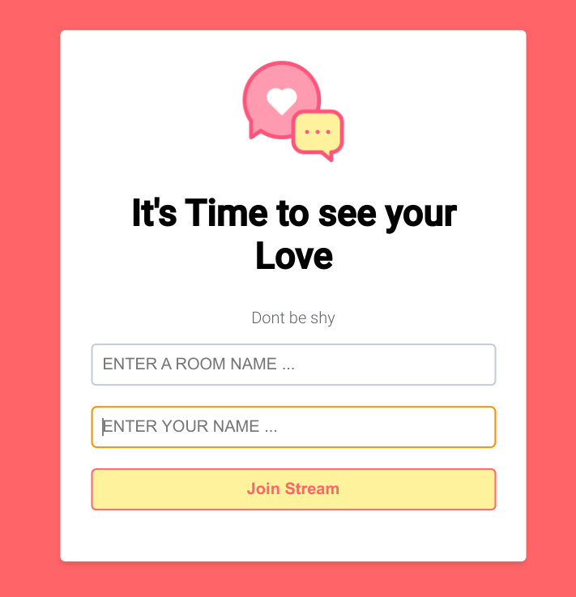

# Django Video Chat

Django Video Chat is a real-time video chat application built with Django and Agora.io. It allows users to create video chat rooms and join ongoing discussions with other users.



## Prerequisites

Before you begin, ensure you have met the following requirements:

- Python 3.8.10
- Django 4.2.5
- Agora.io Developer Account (for Agora integration)

## Initial Setup

1. **Clone the repository:**

   ```bash
   git clone https://github.com/your-username/django-video-chat.git
   ```

2. **Navigate to the project directory:**

   ```bash
   cd django-video-chat
   ```

3. **Create a virtual environment:**

   ```bash
   python -m venv env
   ```

4. **Activate the virtual environment:**

   - On Windows:

     ```bash
     env\Scripts\activate
     ```

   - On macOS and Linux:

     ```bash
     source env/bin/activate
     ```

5. **Install dependencies:**

   ```bash
   pip install -r requirements.txt
   ```

6. **Configure Agora.io API keys:**

   - Sign up at [Agora.io](https://www.agora.io/) to get your API keys.
   - Replace `YOUR_APP_ID` in `settings.py` with your Agora application ID.

7. **Apply migrations:**

   ```bash
   python manage.py migrate
   ```

8. **Start the development server:**

   ```bash
   python manage.py runserver
   ```

Now your Django Video Chat application should be up and running locally, and you can access it in your browser at [http://localhost:8000/](http://localhost:8000/).


Remember to replace `your-username`, `YOUR_APP_ID`, and customize the instructions as needed.


### REMARK

``` ```


must be called in each html file that uses static files even if one file extends an other that all ready has ``